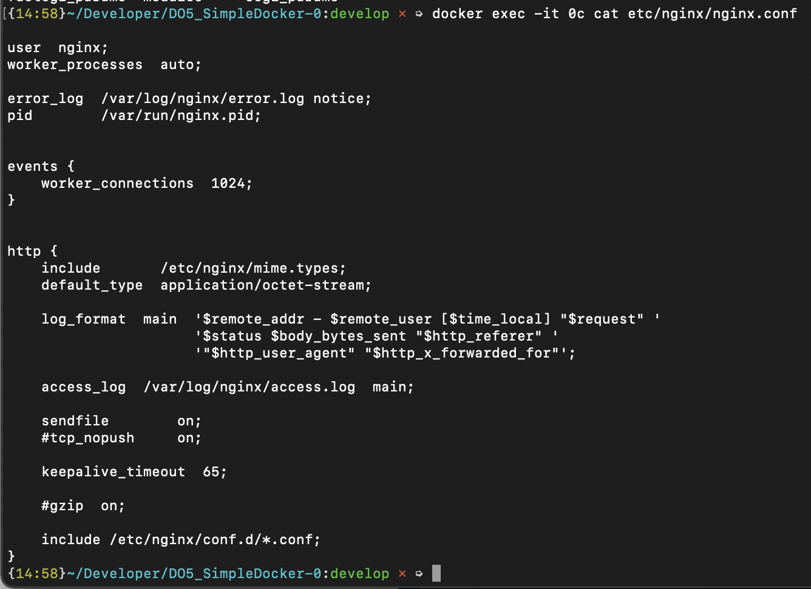
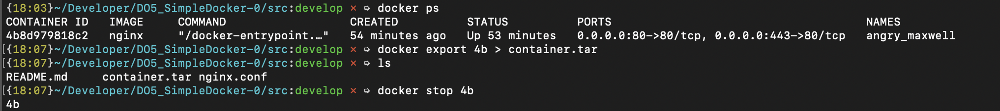

## Part 1. Готовый докер

1. Запустим докер и в терминале выкачаем официальный докер образ с помощью команды

```bash
docker pull nginx
```

2. Проверим образы

```bash
docker images
```


3. Запустим докер образ через

```bash
docker run -d [image_id|repository]
```

*docker run: Run a command in a new container*

*-d: Run container in background and print container ID*

4. Проверим, что докер запустился

```bash
docker ps
```


5. Для просмотра информации о контейнере воспользуемся

```bash
docker inspect [container_id|container_name]
```

Вывод команды внушительный, потому извлече только информацию о размере контейнера, списке замапленных портов и ip контейнера


6. Остановим докер образ и проверим, что образ остановился

```bash
docker stop [container_id|container_name]
```


7. Докер запускает сервис изолированно. Чтобы подключиться из внешней сети или с хоста к сервису нужно использовать сопоставление портов, или *маппинг*. С ним все запросы, проходящие через порт хоста, будут перенаправлены в докер-контейнер. Слева от двоеточия в команде ниже указываем порты нашей локальной машины, справа - контейнера. По умолчанию докер контейнер прослушивает порт 80.

```bash
docker run -d -p 443:80 -p 80:80 nginx
```

*-p: Publish a container's port(s) to the host*


Далее в строке браузера введем и проверим, что по данному адресу доступна стартовая страница nginx.

```bash
http://localhost:80
```


8. перезапустим контейнер и проверем, что он запустился

```bash
docker restart [container_id|container_name]
```


## Part 2. Операции с контейнером

1. Через команду прочитаем файл nginx.conf из контейнера

```bash
docker exec -it 0c cat etc/nginx/nginx.conf
```

_exec запускает команду в контейнере. -i - keep STDIN open even if not attached, -t - allocate a pseudo-TTY_



2. Создадим свой локальный файл и азпишем в него содержимое конфигурационного файла контейнера:

```bash
touch nginx.conf
docker exec -it 4b cat /etc/nginx/nginx.conf > nginx.conf
```

3. Добавим следующий куск кода в http {} в конфигурационном файле:

```bash
server {
        listen 80;
        listen [::]:80;
        location = /status {
          stub_status on;
        }
    }

```

4. Скопируем файл в контейнер и перезапустим контейнер с помощью exec:

```
docker cp nginx.conf [container_id|container_name]:etc/nginx/nginx.conf
docker exec -it [container_id|container_name] service nginx reload 
```

5. Проверим localhost:80/status:

```bash
 open http://127.0.0.1:80/status
```


6.  Для архивирования есть две команды - save и export. Save для images, export работает только с контейнерами - делается snapshot файловой системы. После архивирования остановила контейнер.

```bash
docker export CONTAINER > CONTAINER.tar
```



7. Удалим образ. Так как контейнеры на основе данного образа еще не были удалены, то добавим флаг _-f (--force)_:

```bash
 docker rmi -f IMAGE 
```


8. Удалим контейнер и проверим, что в списке контейнеров его не осталосью (P.S. потом я почитсила и другие контейнеры, чтобы они не мешали.)


9.  Импортировала контейнер и запустила его с помощью следующих команд. В контейнере запустила nginx. Также при запуске контейнера сделала проброс портов, чтобы иметь возможность загрузить через браузер (без проброса портов могла бы проверить в терминале через _'curl http://127.0.0.1:80/status'_):

```bash
docker import container.tar imported_container:latest
docker run -p 80:80 -t -i imported_container /bin/sh
```


## Part 3. Мини веб-сервер

1. Напишем файл на C и fast-cgi для отражения "Hello world!" в браузере. Документация для помощи: https://fastcgi-archives.github.io/FastCGI_Developers_Kit_FastCGI.html

```c
#include <stdio.h>
#include <fcgi_stdio.h>

int main(void) {
    while (FCGI_Accept() >= 0) {
        printf(
            "Content-type: text/html\r\n"
            "\r\n"
            "<title>Hello World!</title>"
            "<p>Hello World!</p>"
        );
    }
    return 0;
}
```

2. На компьютере, на котором я писала скрипт с "Hello world!", запуск скрипта  затруднителен. 
Воспользуемся докер-контейнером. Скачаем nginx образ, запустим контейнер с настроенными портами и в нем сделаем установку необходимых пакетов: spawn-fcgi, gcc, libfcgi-dev. Последняя пригодится при линкове проекта: будет добавлено _-lfcgi_. При помощи spawn-fcgi запустим скомпилированный веб-сервер на порту 8080. 

```bash
sh 03/03.sh
```
- 03/03.sh:
```bash
# Чистка неиспользуемых контейнеров и образов
docker system prune -a -f

# Скачиваем образ nginx и создаем контейнер, прослушивающий 81 порт
docker pull nginx
docker run -d -p 81:81 --name 03 nginx

# Обновляем пакеты системы и устанавливаем gcc spawn-fcgi libfcgi-dev
# -y = yes при запросе "Вы согласны установить то-то?"

docker exec -it 03 apt-get update
docker exec -it 03 apt-get install -y gcc spawn-fcgi libfcgi-dev

# Копируем файлы в контейнер
docker cp 03/03.c 03:home/
docker cp nginx.conf 03:/etc/nginx/

# Запускаем сервер
docker exec -it 03 gcc /home/03.c -o /etc/nginx/webserver -lfcgi
docker exec -it 03 spawn-fcgi -p 8080 /etc/nginx/webserver
docker exec -it 03 service nginx reload 

# Проверяем
open http://localhost:81/
```


https://docs.docker.com/engine/reference/builder/#cmd