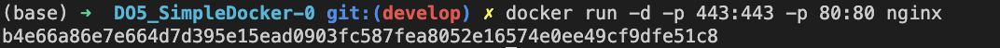
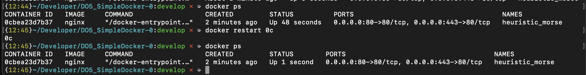

# Simple Docker

Введение в докер. Разработка простого докер образа для собственного сервера.


## Contents

1. [Готовый докер](#part-1-готовый-докер)
2. [Операции с контейнером](#part-2-операции-с-контейнером)
3. [Мини веб-сервер](#part-3-мини-веб-сервер)
4. [Свой докер](#part-4-свой-докер)
5. [Dockle](#part-5-dockle)
6. [Базовый Docker Compose](#part-6-базовый-docker-compose)
    
    
    
## Part 1. Готовый докер

1. Запустим докер и в терминале выкачаем официальный докер образ с помощью команды

```bash
docker pull nginx
```

2. Проверим образы

```bash
docker images
```


3. Запустим докер образ через

```bash
docker run -d [image_id|repository]
```

*docker run: Run a command in a new container*

*-d: Run container in background and print container ID*

4. Проверим, что докер запустился

```bash
docker ps
```


5. Для просмотра информации о контейнере воспользуемся

```bash
docker inspect [container_id|container_name]
```

Вывод команды внушительный, потому извлечем только информацию о размере контейнера, списке замапленных портов и ip контейнера


6. Остановим докер образ и проверим, что образ остановился

```bash
docker stop [container_id|container_name]
```


7. Докер запускает сервис изолированно. Чтобы подключиться из внешней сети или с хоста к сервису нужно использовать сопоставление портов, или *маппинг*. С ним все запросы, проходящие через порт хоста, будут перенаправлены в докер-контейнер. Слева от двоеточия в команде ниже указываем порты нашей локальной машины, справа - контейнера. По умолчанию докер контейнер прослушивает порт 80, к остальным портам (если не указать иное) с локальной машины доступа нет.

```bash
docker run -d -p 443:443 -p 80:80 nginx
```

*-p: Publish a container's port(s) to the host*



Далее в строке браузера введем и проверим, что по данному адресу доступна стартовая страница nginx.

```bash
open http://localhost:80
```


8. перезапустим контейнер и проверем, что он запустился

```bash
docker restart [container_id|container_name]
```




## Part 2. Операции с контейнером

1. Через команду прочитаем файл nginx.conf из контейнера

```bash
docker exec -it 0c cat etc/nginx/nginx.conf
```

_exec запускает команду в контейнере. -i - keep STDIN open even if not attached, -t - allocate a pseudo-TTY_


2. Создадим свой локальный файл и азпишем в него содержимое конфигурационного файла контейнера:

```bash
touch nginx.conf
docker exec -it 4b cat /etc/nginx/nginx.conf > nginx.conf
```

3. Добавим следующий куск кода в http {} в конфигурационном файле:

```bash
server {
        listen 80;
        listen [::]:80;
        location = /status {
          stub_status on;
        }
    }

```

4. Скопируем файл в контейнер и перезапустим контейнер с помощью exec:

```
docker cp nginx.conf [container_id|container_name]:etc/nginx/nginx.conf
docker exec -it [container_id|container_name] service nginx reload 
```

5. Проверим localhost:80/status:

```bash
 open http://127.0.0.1:80/status
```


6.  Для архивирования есть две команды - save и export. Save для images, export работает только с контейнерами - делается snapshot файловой системы. После архивирования остановила контейнер.

```bash
docker export CONTAINER > CONTAINER.tar
```


7. Удалим образ. Так как контейнеры на основе данного образа еще не были удалены, то добавим флаг _-f (--force)_:

```bash
 docker rmi -f IMAGE 
```


8. Удалим контейнер и проверим, что в списке контейнеров его не осталось (P.S. потом я почиcтила и другие контейнеры, чтобы они не мешали.)


9.  Импортировала контейнер и запустила его с помощью следующих команд. В контейнере запустила nginx. Также при запуске контейнера сделала проброс портов, чтобы иметь возможность загрузить через браузер (без проброса портов могла бы проверить в терминале через _'curl http://127.0.0.1:80/status'_):

```bash
docker import container.tar imported_container:latest
docker run -p 80:80 -t -i imported_container /bin/sh
```


## Part 3. Мини веб-сервер

> Для проверки в папке src введите "sh build/03.sh"

1. Напишем файл на C и fast-cgi для отражения "Hello world!" в браузере. Документация для помощи: https://fastcgi-archives.github.io/FastCGI_Developers_Kit_FastCGI.html

```c
#include <stdio.h>
#include <fcgi_stdio.h>

int main(void) {
    while (FCGI_Accept() >= 0) {
        printf(
            "Content-type: text/html\r\n"
            "\r\n"
            "<title>Hello World!</title>"
            "<p>Hello World!</p>"
        );
    }
    return 0;
}
```

2. На компьютере, на котором я писала скрипт с "Hello world!", запуск скрипта  затруднителен. 
Воспользуемся докер-контейнером. Скачаем nginx образ, запустим контейнер с настроенными портами и в нем сделаем установку необходимых пакетов: spawn-fcgi, gcc, libfcgi-dev. Последняя пригодится при линкове проекта: будет добавлено _-lfcgi_. При помощи spawn-fcgi запустим скомпилированный веб-сервер на порту 8080. 

```bash
sh build/03.sh
```
- build/03.sh:
```bash
# Чистка неиспользуемых контейнеров и образов
docker system prune -a -f

# Скачиваем образ nginx и создаем контейнер, прослушивающий 81 порт
docker pull nginx
docker run -d -p 81:81 --name 03 nginx

# Обновляем пакеты системы и устанавливаем gcc spawn-fcgi libfcgi-dev
# -y = yes при запросе "Вы согласны установить то-то?"

docker exec -it 03 apt-get update
docker exec -it 03 apt-get install -y gcc spawn-fcgi libfcgi-dev

# Копируем файлы в контейнер
docker cp server/webserver.c 03:home/
docker cp nginx/nginx.conf 03:/etc/nginx/

# Запускаем сервер
docker exec -it 03 gcc /home/webserver.c -o /etc/nginx/webserver -lfcgi
docker exec -it 03 spawn-fcgi -p 8080 /etc/nginx/webserver
docker exec -it 03 service nginx reload 

# Проверяем
open http://localhost:81/
```


## Part 4. Свой докер

 > Теперь напишем свой докерфайл и в нем пропишем копирование nginx.conf с хоста и установку нужных пакетов. Для проверки задания достаточно ввести "sh build/04.sh".

 1. Dockerfile:

 ```dockerfile
# syntax=docker/dockerfile:1
   
FROM nginx
COPY nginx/nginx.conf /etc/nginx/nginx.conf
COPY server/webserver.c .
COPY build/run_04.sh ./run.sh
RUN apt-get update && \
    apt-get install -y gcc spawn-fcgi libfcgi-dev && \
    gcc webserver.c -o webserver -lfcgi
CMD ["bash", "run.sh"]
 ```

2. Отредактируем nginx.conf

```
events {
}

http {
    server {
        listen 81;
        location / {
          fastcgi_pass 127.0.0.1:8080;
        }
        location = /status {
          stub_status;
        }
    }
}

```

3. run_04.sh для команд, которые запустятся по умолчанию при запуске контейнера:

```sh
#!/bin/bash
spawn-fcgi -p 8080 webserver
nginx -g "daemon off;"
```

4. bash-скриптом 04.sh сбилдим из докерфайла образ и запустим на его основе контейнер с маппингом портов. Откроем http://localhost:80/ на хосте.

```bash
# Чистка контейнеров и образов
docker stop container_04
docker rm container_04
docker rmi image_04:hello

# Cборка и проверка
cat dockerfiles/04 > Dockerfile

docker build -t image_04:hello .   
docker images
docker run -d -p 80:81 --name container_04  image_04:hello

open http://localhost:80/
open http://127.0.0.1:80/status

sleep 5
docker restart container_04

open http://localhost:80/
open http://127.0.0.1:80/status

 ```

5. Скриншоты для проверки данного задания. В конце перезапустили контейнер и проверили, что по тем же ссылкам вебсервер работает.


## Part 5. Dockle

> Для запуска задания достаточно ввести "sh build/05.sh" из src.

1. Установим dockle:

```bash
 brew install goodwithtech/r/dockle
```

2. Запустим на контейнере из предыдущего задания:

```bash
dockle image_04:hello
```


3. Исправим ошибки. 

1) Для решения второй фатальной ошибки добавим rm -rf /var/lib/apt/lists после установки либ. 

2) Для решения первой проблемы в докерфайле будем использовать другой образ, у которого нет ошибки CIS-DO-0010. Также хороошей практикой будет указать конкретную версию образа, чтобы в будущем не использовался другой образ latest. Я использовала 10.13-slim как более легковесный вариант, при этом один из новейших на официальном сайте. 

3) Добавим пользователя nginx и контейнер будем запускаться от его лица. Чтобы всё было в порядке с загрузкой сервера, дадим права к нужным папкам пользователю nginx (команды "chown -R ..."). 

4) Наконец, решим одно INFO, добавив те команды, что советует dockle (список из chmod). Другое INFO решим, используя команду из документации ("HEALTHCHECK --interval=5m --timeout=3s CMD curl -f http://localhost/ || exit 1"). 

5) Для решения CIS-DO-0005 в терминале перед билдом контейнера я ввела "export DOCKER_CONTENT_TRUST=1".

6) Итог:

```docker
# syntax=docker/dockerfile:1

FROM debian:10.13-slim
HEALTHCHECK --interval=5m --timeout=3s \
  CMD curl -f http://localhost/ || exit 1

COPY server ./server/
COPY build/run.sh ./server/
COPY nginx/nginx.conf /etc/nginx/nginx.conf
RUN \
    useradd -ms /bin/bash nginx; \   
    apt-get update; \
    apt-get install -y nginx gcc spawn-fcgi libfcgi-dev; \
    rm -rf /var/lib/apt/lists && \
    chmod 777 bin/umount && \
    chmod 777 usr/bin/chage && \
    chmod 777 usr/bin/newgrp && \
    chmod 777 usr/bin/wall && \
    chmod 777 sbin/unix_chkpwd && \
    chmod 777 bin/su && \
    chmod 777 usr/bin/expiry && \
    chmod 777 bin/mount && \
    chmod 777 usr/bin/chfn && \
    chmod 777 usr/bin/chsh && \
    chmod 777 usr/bin/gpasswd && \
    chmod 777 usr/bin/passwd; \
    chown -R nginx:nginx /server && \
    chown -R nginx:nginx /var/run/ && \
    chown -R nginx:nginx /var/log/nginx/ && \
    chown -R nginx:nginx /var/lib/nginx/

USER nginx

CMD ["bash", "server/run.sh"]
```

7) run.sh также претерпел изменения:

```bash
#!/bin/bash
gcc /server/webserver.c -o /server/webserver -lfcgi
spawn-fcgi -p 8080 /server/webserver
service nginx start
while true; do sleep 5; done
```

8) Проверка на dockle и запускаемость сервера:


## Part 6. Базовый Docker Compose

> Для проверки введите "sh build/docker_compose.sh" в src.

> Сделаем Docker Compose из двух контейнеров - один (server) будет сервером, обрабатывающим запросы, другой (proxy) - прокси-сервером, передающим запросы с локальной машины на сервер.


> http-запрос по умолчанию находится на 80 порту локальной машины. Запрос оттуда должен поступить на 8080 порт прокси сервера (второй контейнер с nginx). Данная связь будет прописана в docker_compose.yml для контейнера proxy. Далее в nginx.conf прокси-сервера укажем, что запросы, поступившие на 8080, должны быть переданы серверу на его 81-й порт (proxy_pass http://server:81). В nginx.conf сервера укажем, что сервер слушает свой 81-й порт и оттуда перенаправляет запросы на свой 8080-й порт. На 8080-м порту расположена служба nginx, которая обработает запрос и выдаст нужный файл.

1. В папке docker_compose/server/ создадим всё необходимое для первого контейнера (сервера). Файлы для сервера, почти без изменений с предыдущего этапа:

```docker
# syntax=docker/dockerfile:1
# Dockerfile for server, located in docker_compose/server/

FROM debian:10.13-slim
HEALTHCHECK --interval=5m --timeout=3s \
  CMD curl -f http://localhost/ || exit 1

COPY server ./server/
COPY build/run.sh ./run.sh
COPY nginx/nginx.conf /etc/nginx/nginx.conf
RUN \
    useradd -ms /bin/bash nginx; \   
    apt-get update; \
    apt-get install -y nginx gcc spawn-fcgi libfcgi-dev; \
    rm -rf /var/lib/apt/lists && \
    chmod 777 bin/umount && \
    chmod 777 usr/bin/chage && \
    chmod 777 usr/bin/newgrp && \
    chmod 777 usr/bin/wall && \
    chmod 777 sbin/unix_chkpwd && \
    chmod 777 bin/su && \
    chmod 777 usr/bin/expiry && \
    chmod 777 bin/mount && \
    chmod 777 usr/bin/chfn && \
    chmod 777 usr/bin/chsh && \
    chmod 777 usr/bin/gpasswd && \
    chmod 777 usr/bin/passwd; \
    chown -R nginx:nginx /server && \
    chown -R nginx:nginx /var/run/ && \
    chown -R nginx:nginx /var/log/nginx/ && \
    chown -R nginx:nginx /var/lib/nginx/

USER nginx

CMD ["bash", "run.sh"]
```

```sh
#!/bin/bash
# This is docker_compose/server/run.sh

gcc /server/webserver.c -o /server/webserver -lfcgi
spawn-fcgi -p 8080 /server/webserver
service nginx start
while true; do sleep 5; done
```

```sh
# This is docker_compose/server/nginx/nginx.conf

events {
}

http {
    server {
        listen 81;
        location / {
          fastcgi_pass 127.0.0.1:8080;
        }
        location = /status {
          stub_status;
        }
    }
}
```

```c
// This is docker_compose/server/webserver.c

#include <stdio.h>
#include <fcgi_stdio.h>

int main(void) {
    while (FCGI_Accept() >= 0) {
        printf(
            "Content-type: text/html\r\n"
            "\r\n"
            "<title>Hello World!</title>"
            "<p>Hello World!</p>"
        );
    }
    return 0;
}
```

2. В папке docker_compose/proxy/ создадим всё необходимое для второго контейнера (прокси-сервера). Прокси-сервер будет получать запросы с локальной машины на свой 8080 порт и передавать на 81 порт сервера - всё это укажем в nginx.conf.

```docker
#This is docker_compose/proxy/Dockerfile

FROM nginx:1.23.2

COPY ./nginx.conf /etc/nginx/nginx.conf
COPY run.sh .
CMD ["sh", "run.sh"]
```

```sh
#!/bin/bash
#This is docker_compose/proxy/run.sh

service nginx start
while true; do sleep 5; done
```

```sh
# This is docker_compose/proxy/nginx.conf
events {
}

http {
    server {
        listen 8080;
        location / {
          proxy_pass http://server:81;
        }
    }
}
```

3. docker_compose.yaml

```yml
version: "3.9"
services:
  server:
    build: ./server/
  proxy:
    build: ./proxy/
    ports:
      - "80:8080"
    depends_on:
      - server
```

- Проверка:

